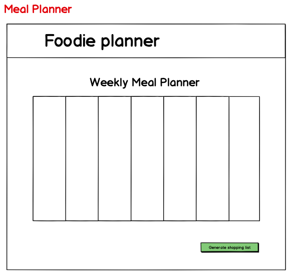

# foodieplanner README :memo:

**foodieplanner** :tomato: is a platform where users can create meal plans of up to a week. Features allow users to generate either a shopping list or a recipe based on what they already have at home.

## Getting started

### Dependencies

Run `yarn` on root folder to install dependencies related to Express.

cd `client` and run yarn install dependencies related to React.

### Run Your Development Servers

- Run `yarn start` in project directory to start the Express server on port 5000
- `cd` client and run `yarn start` to start client server in development mode with hot reloading in port 3000.
- Client is configured so all API calls will be proxied to port 5000
- You can test your client app in `http://localhost:3000`
- You can test your API in `http://localhost:5000`
  &nbsp;
  &nbsp;

#### Full Stack Framework - 1

Recreated from and inspired by, Al Madireddy's article:
[Designing A Web App Architecture](https://dev.to/almadireddy/full-stack-101-2-designing-our-web-app-architecture-l6a)
&nbsp;
&nbsp;

#### Product Userflows -2

&nbsp;
&nbsp;

#### Route File Structuring -3

&nbsp;

&nbsp;
&nbsp;

#### Mock-up - 4

&nbsp;

&nbsp;
&nbsp;

&nbsp;
&nbsp;

&nbsp;
&nbsp;

&nbsp;
&nbsp;

### Future features

- Save to PDF / download functionality
- Export functionality to popular messenging apps such as Whatsapp, Facebook Messenger and Telegram.
- User login, saved recipes and favourite lists

_This is a student project that was created at [CodeOp](http://codeop.tech), a full stack development bootcamp in Barcelona._
